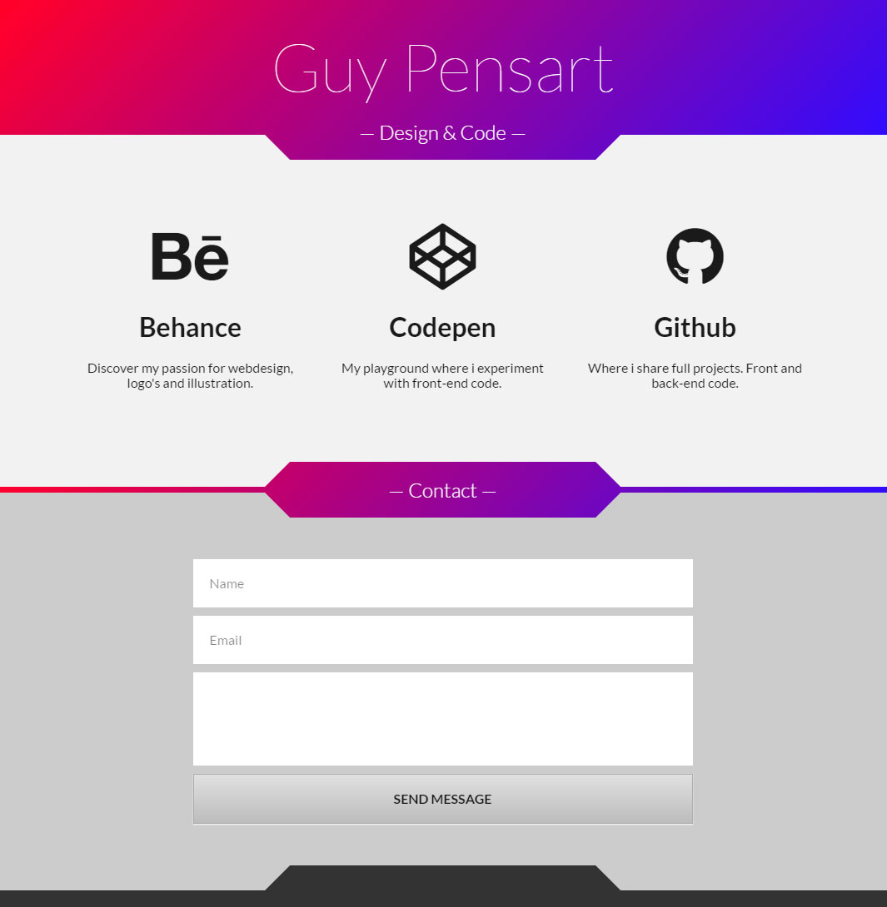

# Clean portfolio portal

## A nice clean portal with some external links to showcase my designs, illustration work & code samples. This idea / concept started when I was tinkering on codepen

### Features
* Animated background gradient
* Random animated icons to draw attention
* Spacey kinda borders per section

### Work in progress
- [x] Codepen project to php page
- [x] Basic form validation to get started
- [x] Add some meta tags for seo (still works)
- [ ] Improve php validation writing a class
- [ ] Write javascript validation for real-time feedback
- [x] Install node modules
- [x] Write taskwatchers to compile scss & javascript